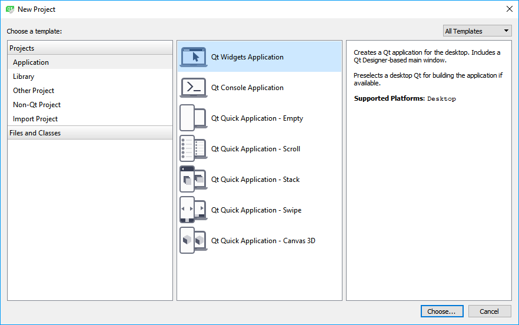
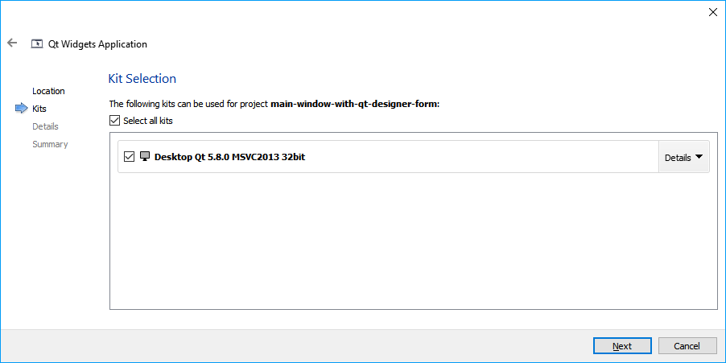
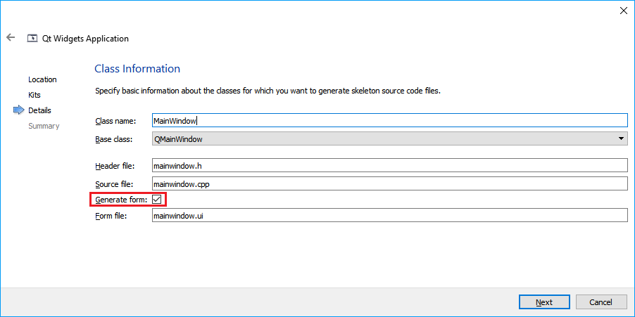
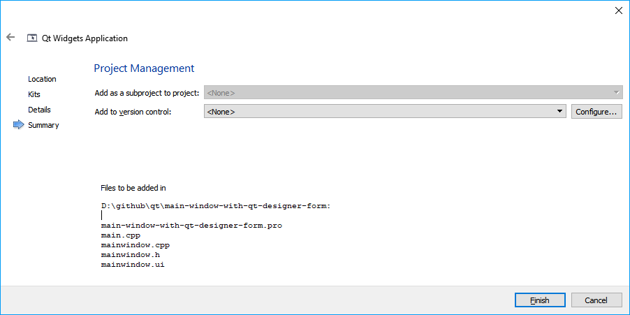

# Main window with qt designer form

qt designer form 이란 *.ui 파일을 말한다. Qt Designer를 이용하여 application GUI를 만들면 이 파일에 GUI 정보가 저장된다. 여기서는 기본적으로 qt designer form을 가지는 application을 만드는 순서를 설명한다. IDE는 Qt Creator를 이용하였다.

